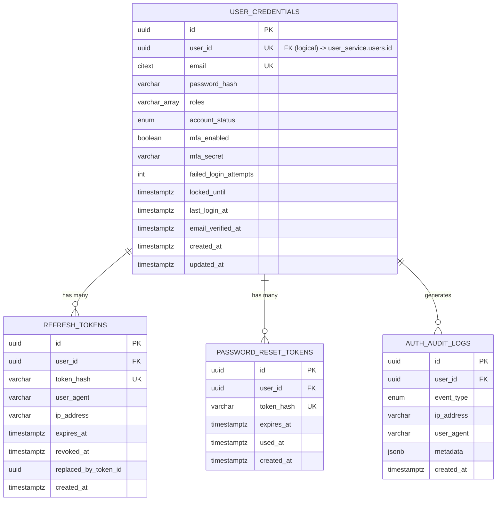

# auth_db — Entity Relationship Diagram

`auth_db` is owned exclusively by `auth-service`. `user_id` is the platform-wide identifier shared with `user-service`'s `user_db` — there is no foreign key across databases, only an application-level UUID reference reconciled through domain events.

Design notes: `password_hash` and `mfa_secret` never leave this database and are never included in any event payload. `token_hash` columns store SHA-256 hashes only — raw JWTs are never persisted, so a database leak does not by itself yield usable tokens. `roles` is a denormalized array maintained by `user-service` events (`UserRoleChanged`) so `auth-service` can embed roles directly into access tokens without a synchronous call on every login.
