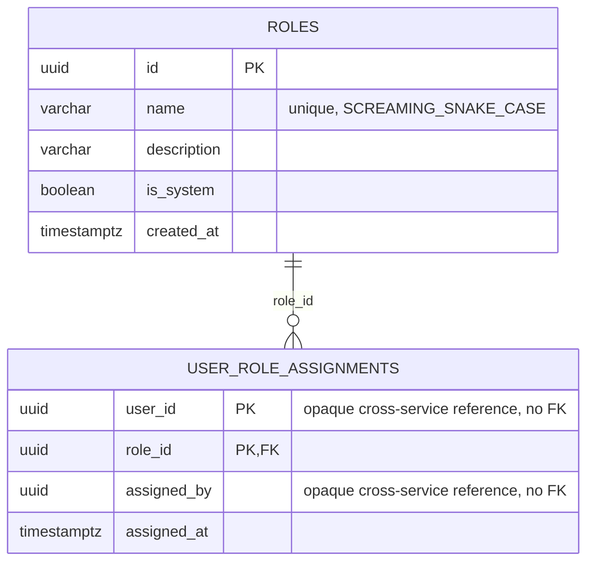

# ebook_db — Entity Relationship Diagram

`ebook_db` is owned exclusively by `ebook-service`. It holds exactly two tables: this module's own role catalog and its own user-to-role assignments.

`USER_ROLE_ASSIGNMENTS.user_id` and `.assigned_by` are plain UUID columns with **no foreign key** to any `users` table — this service holds no user profile data at all. `userId` is an opaque cross-service reference, exactly like `auth-service`'s `userId` field has no FK to `user-service`: the caller's identity comes from the verified JWT, and this service only ever needs to know "does this userId hold this role in this module", which is answerable entirely from its own two tables.

## Standalone RBAC decision

The platform's SRS defines module-specific roles (e.g. `BOOK_EDITOR`, `DIGITAL_CONTENT_MANAGER`) per content area. Rather than centralizing every module's roles in `user-service`, each content module (journals, ebooks, library, wikipedia, repository, researcher network) owns its own role catalog and its own user-to-role assignments, with **zero runtime dependency on user-service or auth-service for authorization**. A module service only trusts the JWT (verified locally, same shared `JWT_ACCESS_SECRET` contract every service already uses) for the caller's *identity* (`userId`, `email`); it never makes a synchronous HTTP call to another service to check what role someone has. This keeps each module independently deployable and avoids a single "authorization service" becoming a availability bottleneck for the whole platform.

## The bootstrap trick

The very first person able to assign `ebook-service` roles to anyone needs a role already assigned by *someone* — a chicken-and-egg problem identical to the platform-wide super-admin bootstrap in `auth-service`/`user-service`. `module-admin.bootstrap.ts` solves it the same way: on startup, if `SUPER_ADMIN_EMAIL` is set, it derives `computeBootstrapUserId(email)` — a deterministic UUID v5, byte-for-byte the same function and namespace constant as every other service's copy of `bootstrap-id.util.ts` — and assigns that userId both `AUTHOR_RESEARCHER` (this module's base role) and `BOOK_EDITOR` (this module's top role) if the assignment doesn't already exist. Because every service computes the same id from the same email independently, no cross-service handshake or synchronous call is needed to keep them in agreement.
