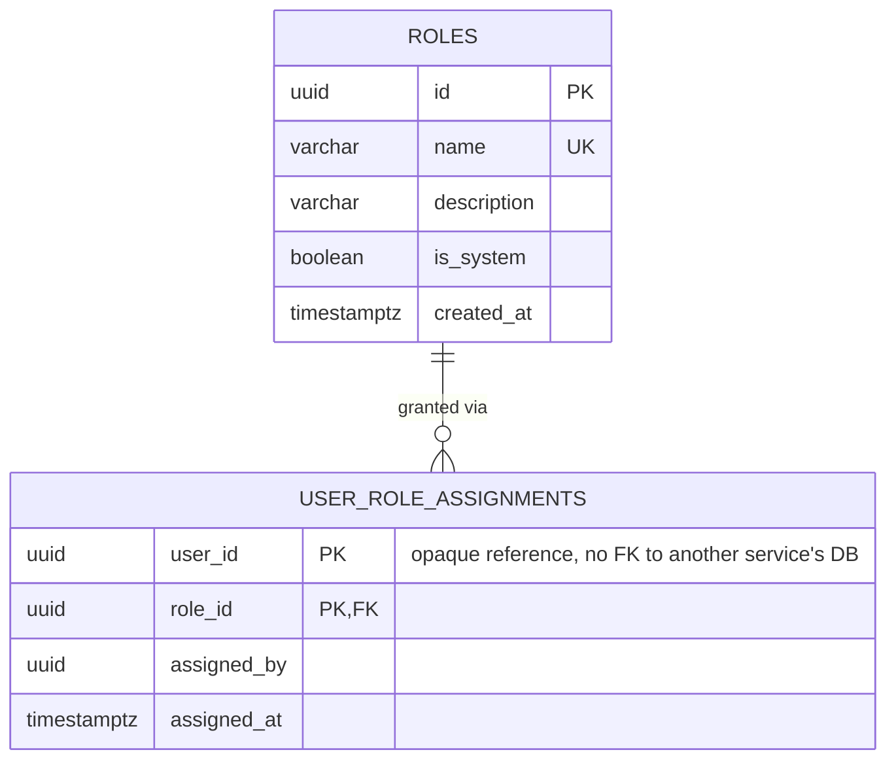

# journal_db — Entity Relationship Diagram

`journal_db` is owned exclusively by `journal-service`. There is no `users`
table here — `user_id` is an opaque cross-service reference (the same
platform-wide id `auth-service`/`user-service` use), never a foreign key,
exactly like `auth-service.user_credentials.user_id` has no FK into
`user-service`.

## Standalone-RBAC decision and the bootstrap trick

The platform's SRS defines module-specific roles per content area (journals,
ebooks, library, wikipedia, repository, researcher network). Rather than
have every module call back into `user-service` over HTTP to check "what
role does this person have in the journal module?" on every request, each
content module owns its own `roles` + `user_role_assignments` tables and
does that lookup 100% locally. A module service only trusts the platform
JWT (verified locally, same shared `JWT_ACCESS_SECRET` every service uses)
for the caller's *identity* (`userId`, `email`) — never for module
authorization, which always comes from this database.

This creates the same chicken-and-egg problem the platform-wide super-admin
bootstrap solves: the very first person able to assign roles in this module
needs a role already assigned by *someone*. `module-admin.bootstrap.ts`
solves it the same way `user-service`'s `super-admin.bootstrap.ts` does —
if `SUPER_ADMIN_EMAIL` is set, it derives the platform's deterministic
bootstrap user id via `computeBootstrapUserId(email)` (UUID v5, same
namespace constant byte-for-byte in every service) and assigns that user id
both the module's base role (`AUTHOR`) and its top role (`JOURNAL_MANAGER`),
idempotently, at startup — no coordination with any other service required.
