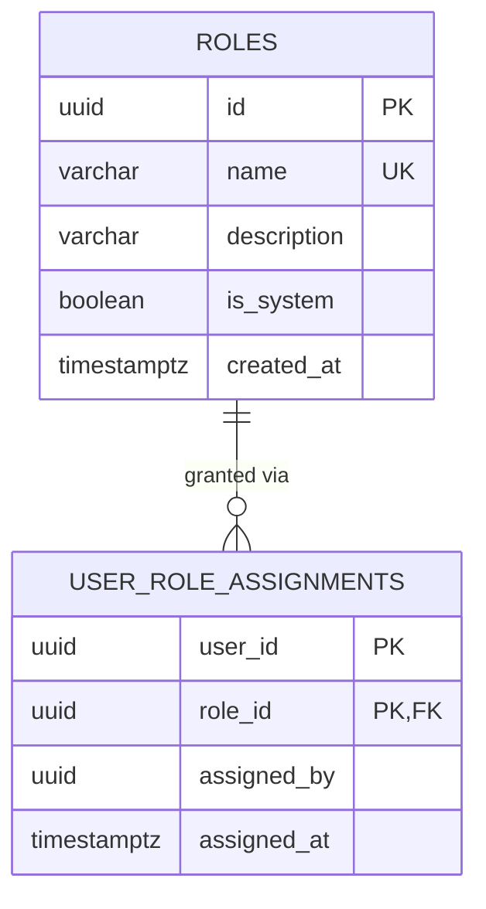

# library_db — Entity Relationship Diagram

`library_db` is owned exclusively by `library-service`. There is no `users` table here — `userId` is an opaque cross-service reference, exactly like `auth-service`'s `user_credentials.user_id` has no foreign key into `user-service`.

## Standalone RBAC decision

The platform's SRS defines module-specific roles per content area (journals, ebooks, library, wikipedia, repository, researcher network). Rather than centralizing authorization in `user-service`, each content module — including this one — owns its own `roles` catalog and `user_role_assignments` table, with **zero runtime dependency on `user-service` or `auth-service` for authorization**. `library-service` only trusts the JWT (verified locally with the shared `JWT_ACCESS_SECRET`) for the caller's *identity* (`userId`, `email`); it never makes a synchronous HTTP call to another service to check what role someone holds — that lookup is 100% local. This keeps the module resilient to `user-service`/`auth-service` outages and keeps its dependency footprint minimal (no Redis, no RabbitMQ — see `README.md`).

Eleven system roles (`LIBRARY_MANAGER`, `ADMIN`, `SYSTEM_ADMINISTRATOR`, `DIGITAL_LIBRARIAN`, `LIBRARIAN`, `ACQUISITION_OFFICER`, `CATALOGER`, `INVENTORY_MANAGER`, `CONTENT_UPLOADER`, `EXTERNAL_PUBLISHER`, `MEMBER`) are seeded by the initial migration, covering both the Digital and Physical Library Management sub-systems from the SRS in this one service. `LIBRARY_MANAGER` is this module's top role — the only role allowed to create/delete custom roles and assign/revoke roles for other members. `MEMBER` is the base role, auto-assigned alongside `LIBRARY_MANAGER` when the platform super-admin is bootstrapped.

## The bootstrap trick

The very first person able to assign roles in this module needs a role already assigned by *someone* — the same chicken-and-egg problem the platform-wide super-admin bootstrap solves. `infrastructure/bootstrap/module-admin.bootstrap.ts` runs once at startup and, if `SUPER_ADMIN_EMAIL` is set, computes `computeBootstrapUserId(email)` — the same deterministic UUID v5 every service in the platform derives for that email, via a byte-for-byte copy of `auth-service`'s `bootstrap-id.util.ts` — and assigns that userId both `MEMBER` and `LIBRARY_MANAGER` in this database. It is idempotent (a no-op, logged at debug, once the assignment already exists) and safe to leave `SUPER_ADMIN_EMAIL` set across every restart.
