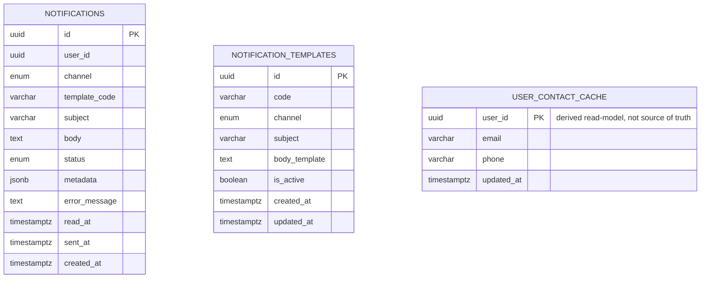

# notification_db — Entity Relationship Diagram

`notification_db` is owned exclusively by `notification-service`. Unlike most other services, this one has no direct foreign-key-style relationship to `user_id` beyond the loose reference every service shares — `user_contact_cache` is explicitly a derived, rebuildable read-model, not a source of truth (see the entity's doc comment).

`(code, channel)` is unique on `NOTIFICATION_TEMPLATES` — the same event can render differently per channel (see the seed data in the initial migration). `NOTIFICATIONS.template_code` and `.channel` are a soft reference to the template used at send time (kept as plain columns, not a foreign key, so a template can be edited or deleted later without breaking historical delivery-log rows — the log should reflect what was actually sent, immutably). `USER_CONTACT_CACHE` is populated from `auth.registered` / `user.registered` events as they arrive and is safe to truncate and rebuild by replaying those events; `notification-service` never treats it as authoritative and falls back to the email carried directly in an event's payload when present (see `NotificationDispatchService.dispatchOne`).
