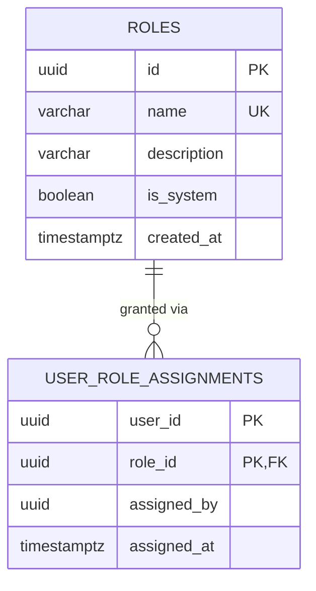

# repository_db — Entity Relationship Diagram

`repository_db` is owned exclusively by `repository-service`. There is no `users` table here: `user_role_assignments.user_id` is an opaque cross-service reference, exactly like `auth-service`'s `userId` field has no FK to `user-service` — never a cross-database foreign key.

## Standalone-RBAC design note

The platform's SRS defines module-specific roles (e.g. journal manager, editor-in-chief, and here `RESEARCHER_AUTHOR` / `REPOSITORY_CURATOR` / `CONTENT_REVIEWER` / `REPOSITORY_ADMINISTRATOR`) for each content area. Rather than have every content module call back into `user-service` on every request to ask "what role does this caller have in my module?", each module owns its own role catalog and its own role-assignment table, fully standalone. `repository-service` verifies the JWT locally (same shared `JWT_ACCESS_SECRET` contract every service uses) purely to establish the caller's *identity* (`userId`, `email`); it never makes a synchronous HTTP call to another service to check authorization. The very first person able to assign roles in a brand-new module has the same chicken-and-egg problem the platform-wide super-admin bootstrap solves in `auth-service`/`user-service`: `module-admin.bootstrap.ts` derives the same deterministic UUID v5 user id from `SUPER_ADMIN_EMAIL` (via `computeBootstrapUserId`, byte-for-byte identical across every service's copy of that file) and assigns that id both this module's base role (`RESEARCHER_AUTHOR`) and its top role (`REPOSITORY_ADMINISTRATOR`) at startup, idempotently, with no coordination required with any other service.

There is no separate `Permission` entity — this module follows the same role-only authorization model documented in `user-service/README.md`: "permission" is expressed entirely as `requireRoles(...)` guards on routes.
