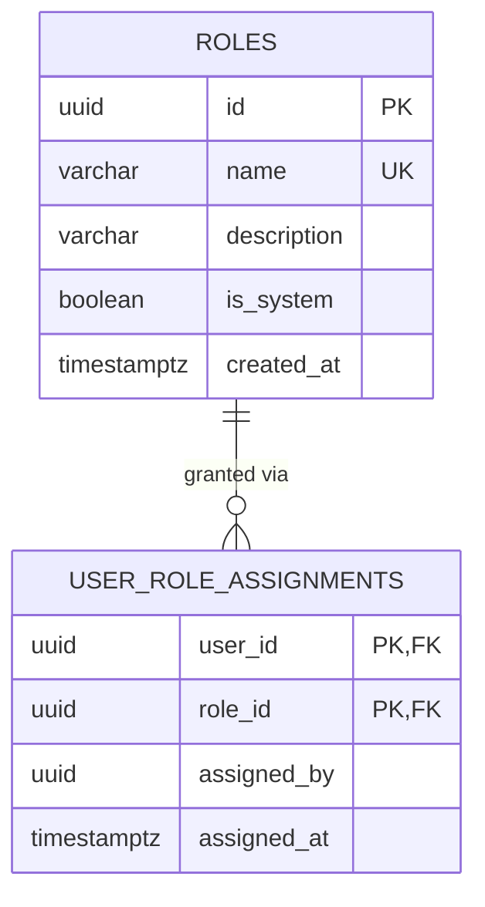

# researcher_db — Entity Relationship Diagram

`researcher_db` is owned exclusively by `researcher-service`. It holds exactly two tables — the module's own role catalog and its own user-to-role assignments — and nothing else. There is no `users` table here: `userId` is an opaque cross-service reference, exactly like `auth-service`'s `userId` field has no foreign key into `user-service`.

## Standalone-RBAC decision and the bootstrap trick

The platform's SRS defines module-specific roles per content area (journals, ebooks, library, wikipedia, repository, researcher network). Rather than centralizing roles in `user-service`, each content module — including this one — owns its own role catalog and role assignments, with **zero runtime dependency** on `user-service` or `auth-service` for authorization: this service only trusts the JWT (verified locally with the shared `JWT_ACCESS_SECRET`) for the caller's *identity* (`userId`, `email`); it never makes an HTTP call to another service to check what role someone has. That lookup is 100% local, against `researcher_db`. This creates the same chicken-and-egg problem the platform-wide super-admin bootstrap solves: the very first person able to assign roles in this module needs a role already assigned by *someone*. `module-admin.bootstrap.ts` solves it the same way `user-service`'s `super-admin.bootstrap.ts` does — on startup, if `SUPER_ADMIN_EMAIL` is set, it derives a deterministic userId from the email via `computeBootstrapUserId` (UUID v5, the same namespace constant every service in the platform shares) and assigns that userId both the module's `BASE_ROLE` (`RESEARCHER_MEMBER`) and its `TOP_ROLE` (`PLATFORM_ADMINISTRATOR`), idempotently, with no coordination required with any other service.

`RESEARCHER_MEMBER`, `GROUP_MODERATOR`, `EVENT_CONTENT_MANAGER`, and `PLATFORM_ADMINISTRATOR` are all seeded as `is_system = true` by the initial migration and cannot be deleted through the API; only `PLATFORM_ADMINISTRATOR` may create/delete custom roles or assign/revoke roles for other members.
