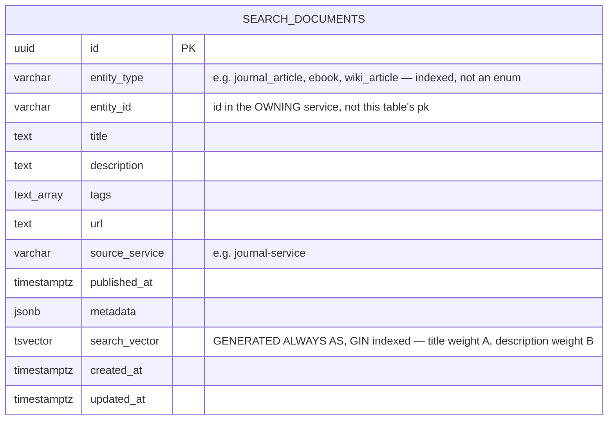

# search_db — Entity Relationship Diagram

`search_db` is owned exclusively by `search-service`. It holds exactly one table, `search_documents`, and — unlike every other service's database in this platform — **it is not a source of truth for anything**. It is a derived, rebuildable read-model: every row is a projection built from `*.published` / `*.updated` / `*.deleted` domain events consumed off `ora.journal.events`, `ora.ebook.events`, `ora.library.events`, `ora.repository.events`, `ora.wiki.events`, and `ora.researcher.events` (see `src/infrastructure/messaging/event-consumer.ts` and `src/application/services/event-mapper.ts`). It is always safe to `TRUNCATE search_documents` and rebuild it from scratch by replaying those events from the start of each exchange's queue/log — nothing else in the platform reads from `search_db`, and `search-service` never writes to any other service's database. There is deliberately no REST write/ingest endpoint into this table (see `docs/01-architecture.md` §3, "Search is a derived store").

`(entity_type, entity_id)` is the natural, unique key — every consumed event upserts by this pair (`SearchDocumentRepository.upsert`), so redelivery of the same event (at-least-once delivery, per `docs/01-architecture.md` §6) is idempotent. `search_vector` is a Postgres `GENERATED ALWAYS AS ... STORED` column, computed automatically by Postgres itself from `title` (search weight `'A'`) and `description` (weight `'B'`) on every insert/update — the application layer never writes to it directly, and it is declared on the TypeORM entity with `select: false, insert: false, update: false` for exactly that reason. A `GIN` index on `search_vector` backs `GET /search?q=...`, which uses `plainto_tsquery('english', :q)` and orders by `ts_rank(search_vector, ...)` when a query is present.
