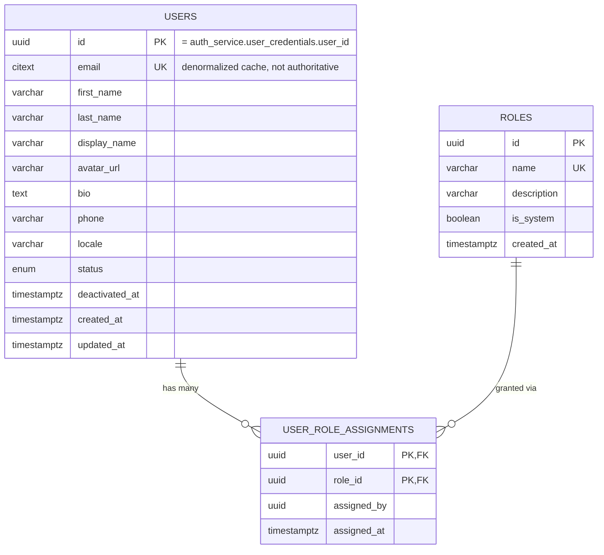

# user_db — Entity Relationship Diagram

`user_db` is owned exclusively by `user-service`. `users.id` is the platform-wide `userId` shared with `auth-service`'s `user_credentials.user_id` and referenced by every content service (`journal-service.authorUserId`, etc.) — again, a logical reference only, never a cross-database foreign key.

Design notes: `USER_ROLE_ASSIGNMENTS` is a join table modeled explicitly (not a TypeORM `@ManyToMany`) so `assigned_by`/`assigned_at` are queryable, auditable columns rather than hidden in a join. Six system roles are seeded by the initial migration (`USER`, `RESEARCHER`, `EDITOR`, `REVIEWER`, `LIBRARIAN`, `ADMIN`) matching the platform's user swimlanes; every new profile is auto-assigned `USER`. `auth-service` embeds a snapshot of a user's role names into each access token at login time — it does not call back into `user-service` per request — so a role change here takes effect on the user's *next* login/token refresh, not instantly; this is the standard eventual-consistency trade-off documented in `docs/01-architecture.md` §3 and §5.
