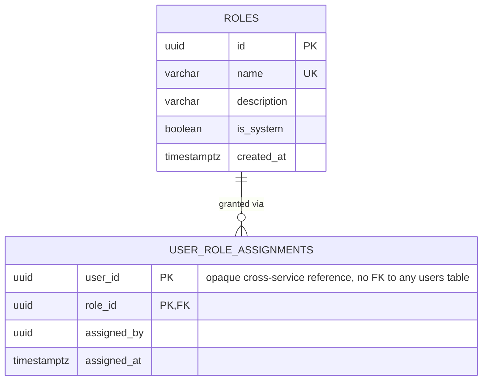

# wiki_db — Entity Relationship Diagram

`wiki_db` is owned exclusively by `wiki-service`. It holds only the user-management slice of the Oromo Wikipedia Platform module: the role catalog and per-user role assignments. There is no `users` table here — `user_role_assignments.user_id` is an opaque cross-service reference to the identity `auth-service` issues tokens for, exactly the same way `auth-service`'s own `users.id` has no foreign key into `user-service`.

## Standalone-RBAC decision, and the bootstrap trick

The platform's SRS defines module-specific roles per content area. The platform owner decided each content module (journals, ebooks, library, wikipedia, repository, researcher network) must own its own roles/permissions catalog and its own user-to-role assignments, fully standalone — **zero runtime dependency on `user-service` or `auth-service` for authorization**. This service only trusts the JWT (verified locally, same shared `JWT_ACCESS_SECRET` contract every service already uses) for the caller's *identity* (`userId`, `email`); it never calls another service over HTTP to check what role someone has, because that lookup is entirely local to `wiki_db`.

That standalone-ness creates the same chicken-and-egg problem the platform-wide super-admin bootstrap solves elsewhere: the very first person able to assign roles in this module needs a role already assigned by *someone*. `src/infrastructure/bootstrap/module-admin.bootstrap.ts` solves it the same way `user-service`'s `super-admin.bootstrap.ts` solves the platform-wide version — if `SUPER_ADMIN_EMAIL` is set, it derives a deterministic UUID v5 user id from that email (`computeBootstrapUserId`, byte-for-byte identical across every service in the platform) and assigns that id both `REGISTERED_EDITOR` (this module's base role) and `BUREAUCRAT` (this module's top role) once, idempotently, at startup — no HTTP call to any other service required.
